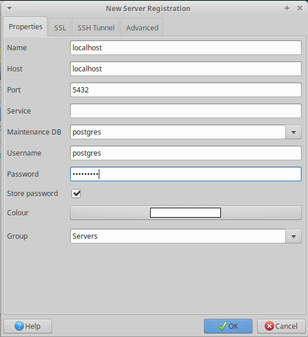

# Installing Odoo 12 on Ubuntu 18.04

Settings > Softwares and Updates > Ubuntu Software: Download From: Server for United States
```
$ sudo apt-get update
```

Run "Software Updater"
```
$ sudo apt-get install git
```

### User creation:
```
# apt-get update && apt-get upgrade # Install system updates
# apt-get install sudo # Make sure 'sudo' is installed
```

The next set of commands will create an **odoo** user:
```
# sudo useradd -m -g sudo -s /bin/bash odoo # Create an 'odoo' user with sudo powers
# sudo passwd odoo # Ask and set a password for the new user
```

Now we can log in as the new user and set up Odoo.

```
$ whoami
odoo
$ echo $HOME
/home/odoo
```

### Install Python Dependencies for Odoo 12
```
$ sudo apt install git python3-pip build-essential wget python3-dev python3-venv python3-wheel libxslt-dev libzip-dev libldap2-dev libsasl2-dev python3-setuptools node-less
```

### Install Dependencies Using pip3
```
$ pip3 install Babel decorator docutils ebaysdk feedparser gevent greenlet html2text Jinja2 lxml Mako MarkupSafe mock num2words ofxparse passlib Pillow psutil psycogreen psycopg2 pydot pyparsing PyPDF2 pyserial python-dateutil python-openid pytz pyusb PyYAML qrcode reportlab requests six suds-jurko vatnumber vobject Werkzeug XlsxWriter xlwt xlrd
```

### Odoo Web Dependencies
```
$ sudo apt-get install -y npm
$ sudo ln -s /usr/bin/nodejs /usr/bin/node
$ sudo npm install -g less less-plugin-clean-css
$ sudo apt-get install node-less
$ sudo python3 -m pip install libsass
```

### Install PostgreSQL 9.6+
```
$ sudo apt-get install python3-software-properties
$ sudo nano /etc/apt/sources.list.d/pgdg.list
```

Add a line for the repository
```
deb http://apt.postgresql.org/pub/repos/apt/ xenial-pgdg main
```

```
$ wget --quiet -O - https://www.postgresql.org/media/keys/ACCC4CF8.asc | sudo apt-key add -
$
$ sudo apt-get update
$ sudo apt-get install postgresql-9.6
```

Create Database user for Odoo
```
$ sudo su postgres
$ cd
$ createuser -s odoo
$ exit
$
$ sudo -u postgres psql
```

Show roles and databases in PostgreSQL
```
postgres=# SELECT rolname FROM pg_roles;
postgres=# \l
```

Change **postgres** user default password
```
postgres=# \password
Enter new password:
Enter it again:
postgres=#
```

Delete databases (optional)
```
postgres=# DROP DATABASE target_database;
```

Quit from PostgreSQL database console
```
postgres=# \q
```

Install pgadmin3
```
$ sudo apt-get install pgadmin3
```


### Install Gdata
```
$ cd ~/Downloads/
$
$ sudo wget https://pypi.python.org/packages/a8/70/bd554151443fe9e89d9a934a7891aaffc63b9cb5c7d608972919a002c03c/gdata-2.0.18.tar.gz
$
$ sudo tar zxvf gdata-2.0.18.tar.gz
$
$ sudo chown -R odoo: gdata-2.0.18
$
$ sudo -s
$
$ cd gdata-2.0.18/
$
$ python setup.py install
$
$ exit
```

### Download Odoo 12 from GitHub
```
$ mkdir ~/odoo-dev # Create a directory to work in
$ cd ~/odoo-dev # Go into our work directory
$ git clone https://github.com/odoo/odoo.git -b 12.0 --depth=1 # Get Odoo source code
```

### Create Odoo Log File
```
$ sudo mkdir /var/log/odoo
$ sudo chown -R odoo:root /var/log/odoo
```

### Edit Odoo configuration file
```
$ sudo nano /etc/odoo.conf
```

Copy and paste below content in config file, **write correct addons paths**

```
[options]

; This is the password that allows database operations:

; admin_passwd = admin

db_host = False

db_port = False

db_user = odoo

db_password = False

logfile = /var/log/odoo/odoo-server.log

addons_path = /opt/odoo/addons,/opt/odoo/odoo/addons
```

Save and Exit the file. Now run the below command on terminal to grant ownership.
```
$ sudo chown odoo: /etc/odoo.conf
```

### WKHTMLTOPDF ( Supported Version 0.12.1 ) for Odoo
```
$ cd ~/Downloads/
$ sudo wget https://builds.wkhtmltopdf.org/0.12.1.3/wkhtmltox_0.12.1.3-1~bionic_amd64.deb
$ sudo apt install ./wkhtmltox_0.12.1.3-1~bionic_amd64.deb
$ sudo cp /usr/local/bin/wkhtmltoimage /usr/bin/wkhtmltoimage
$ sudo cp /usr/local/bin/wkhtmltopdf /usr/bin/wkhtmltopdf
```

### Now Start Odoo Server
```
$ cd ~/odoo-dev/odoo
$ ./odoo-bin
```

### Go to web browser to access Odoo 12
```
http://localhost:8069
```

### Any error related to libfontconfig, libxrender not found then.SOLUTION
```
$ sudo apt-get -f install libxrender1 libjpeg-turbo8 libfontconfig1 fonts-dejavu-core ttf-bitstream-vera fonts-freefont-ttf gsfonts libfontenc1 libxfont1 x11-common xfonts-encodings xfonts-utils gsfonts-x11 fontconfig-config libfontconfig1 fontconfig
```
